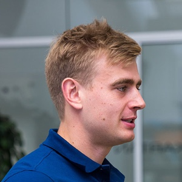

## Toiminnallinen harjoittelu

Toiminnallinen harjoittelu on käytännöllistä harjoittelua joka tukee henkilön arkipäiväisiä toimia, harrastuksia ja ennaltaehkäisee loukkaantumisia. Toiminnallinen harjoittelu sisältää usein liikkeitä joita tehdään omalla kehonpainolla tai vapailla painoilla ja vältetään kuntosalilaitteen penkkiin eristäytymistä. Kuin harjoitellaan vapailla painoilla tai omalla kehonpainolla, kehittyy kehon tukevat ja avustavat lihakset paljon tehokkaammin koska kroppa joutuu tekemään työtä hyvän ryhdin ja tasapainon säilyttämiseksi.

---

## Palvelut

**Functional personal training**  
Toiminnallista henkilökohtaista valmennusta tavoitteesi saavuttamiseksi.

**Liikunnanohjaus**  
Ryhmäliikuntaa yrityksille, seuroille, kouluille tai muille ryhmille.

[Lue lisää palvelut -sivulta](/palvelut/)

---

## Yhteystiedot

Olen Sampsa Visuri, Funktumin perustaja. Toimin pääkaupunkiseudulla liikuntaneuvojana ja [FISAF](http://www.fisafinternational.com/en/) & [Europe Active](http://www.europeactive.eu/) lisensoimana personal trainerina. Olen pitkään ollut kiinnostunut kehonhallinnasta ja omalla kehon painolla harjoittelemisesta. Kokemusta löytyy myös kuntosalin puolelta.

**Sampsa Visuri
**  
[+358 40 351 3174
](tel:+358403513174)  
[{{ site.email }}](mailto:{{ site.email }})
